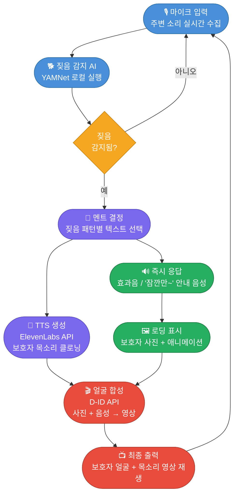
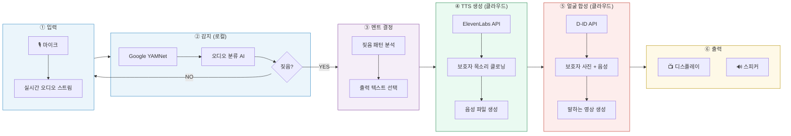
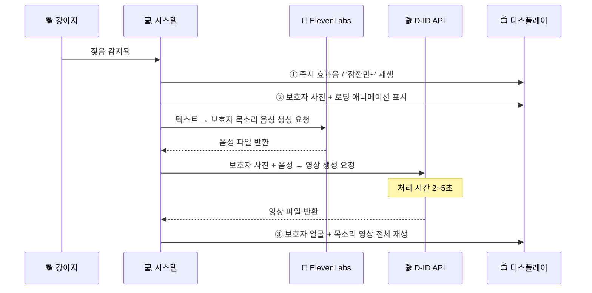
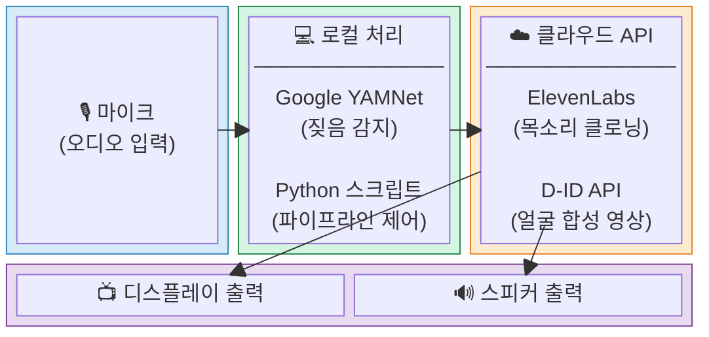
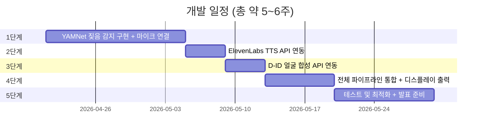
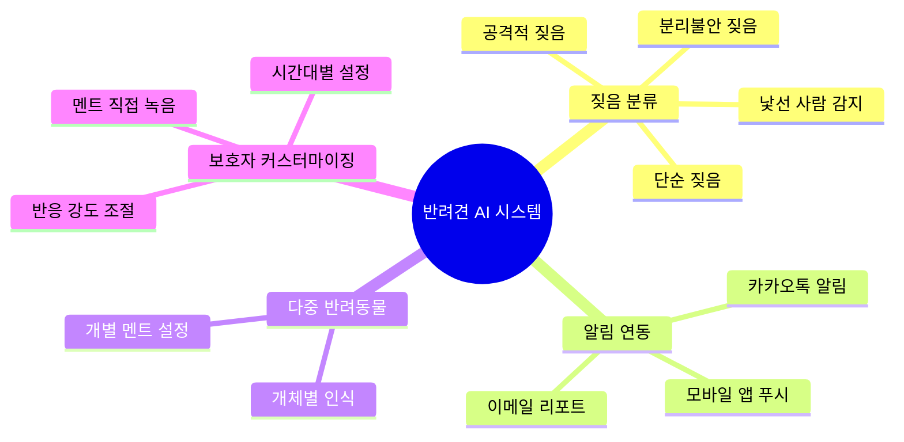

# 졸업작품 기획안
> AI 기반 반려견 짖음 감지 및 보호자 영상 출력 시스템

---

## 프로젝트 개요

| 항목 | 내용 |
|------|------|
| **프로젝트명** | AI 기반 반려견 짖음 감지 및 보호자 영상 출력 시스템 |
| **목적** | 강아지가 짖을 때 보호자의 AI 클로닝 얼굴과 목소리로 반응 |
| **핵심 기술** | 짖음 감지 AI + 목소리 클로닝 TTS + AI 얼굴 합성 |
| **구현 방식** | 클라우드 API 활용 (ElevenLabs + D-ID) |
| **타겟 환경** | 라즈베리파이 or 노트북 + 마이크 + 디스플레이 |

---

## 시스템 전체 흐름



---

## 6단계 파이프라인 상세



---

## 딜레이 UX 처리 흐름

> D-ID API 영상 생성에는 약 **2~5초**의 처리 시간이 소요됩니다. 자연스럽게 처리하기 위해 아래 방식을 적용합니다.



---

## 사용 기술 및 API

| 구분 | 기술/API | 역할 | 실행 위치 | 비용 |
|------|----------|------|-----------|------|
| 짖음 감지 | Google YAMNet | 오디오 분류 AI 모델 | 로컬 | 무료 |
| 목소리 클로닝 | ElevenLabs API | 보호자 목소리 학습 + TTS 생성 | 클라우드 | 월 10,000자 무료 |
| 얼굴 합성 | D-ID API | 사진 + 음성 → 말하는 영상 생성 | 클라우드 | 20크레딧 무료 |
| 하드웨어 | 라즈베리파이 or 노트북 | 전체 시스템 구동 + 디스플레이 출력 | 온프레미스 | - |

---

## 기술 스택 구성도



---

## 개발 단계 및 일정



### 단계별 상세

| 단계 | 내용 | 난이도 | 예상 기간 |
|------|------|--------|-----------|
| 1단계 | YAMNet 짖음 감지 구현 + 마이크 연결 | ★★☆☆☆ | 1~2주 |
| 2단계 | ElevenLabs TTS API 연동 | ★★☆☆☆ | 3~4일 |
| 3단계 | D-ID 얼굴 합성 API 연동 | ★★☆☆☆ | 3~4일 |
| 4단계 | 전체 파이프라인 통합 + 디스플레이 출력 | ★★★☆☆ | 1주 |
| 5단계 | 테스트 및 최적화 + 발표 준비 | ★★★☆☆ | 1~2주 |

---

## 디렉토리 구조 (예정)

```
dog-care/
├── main.py                  # 전체 파이프라인 진입점
├── detector/
│   ├── yamnet_model.py      # YAMNet 짖음 감지 모듈
│   └── audio_stream.py      # 마이크 오디오 스트림 처리
├── tts/
│   └── elevenlabs_tts.py    # ElevenLabs TTS 음성 생성
├── avatar/
│   └── did_avatar.py        # D-ID 얼굴 합성 영상 생성
├── ux/
│   ├── loading_animation.py # 로딩 중 보호자 사진 + 애니메이션
│   └── player.py            # 영상/음성 재생
├── assets/
│   ├── guardian_photo.jpg   # 보호자 사진
│   └── responses/           # 텍스트 멘트 목록
└── config.py                # API 키 및 설정값
```

---

## 졸업작품 어필 포인트

| 포인트 | 설명 |
|--------|------|
| **AI 기술 2종 결합** | 짖음 분류 AI + 목소리/얼굴 클로닝으로 'AI 융합 프로젝트'로 어필 가능 |
| **실용성** | 반려동물 인구 1,500만 시대에 직접적으로 적용 가능한 아이디어 |
| **실시간 동작** | 단순 영상 재생이 아닌 실시간 AI 생성으로 기술적 완성도 강조 |
| **확장 가능성** | 짖음 패턴 분류, 앱 알림 연동, 다중 반려동물 지원 등으로 발전 가능 |

---

## 확장 아이디어



---

> 본 기획안은 대화 내용을 바탕으로 정리된 초안입니다.
